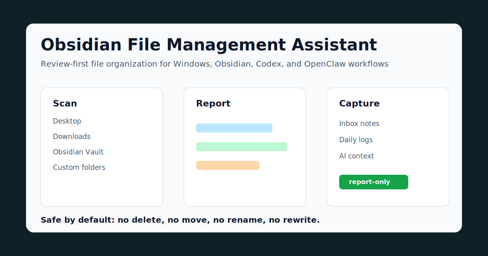

# Obsidian File Management Assistant

> Local-first Windows file organizer and Obsidian workflow assistant for inbox review, knowledge base audit, and safe daily file management.



Local-first Windows assistant for file archiving, Obsidian vault review, daily work capture, and Codex/OpenClaw handoff.


**Keywords:** Obsidian file management, Obsidian assistant, personal knowledge management, Windows file organizer, knowledge base audit, local-first productivity, Codex assistant, OpenClaw, PKM automation.

## Who This Project Is For

- Obsidian users whose Desktop and Downloads are drifting out of control
- Windows users who want a **review-first** file workflow instead of risky auto-cleanup
- People building a local knowledge base around Codex, OpenClaw, or personal PKM systems
- Users who need daily reports, vault audits, and a small local GUI without cloud dependencies

## Why This Project Exists

This project turns scattered desktop files, downloads, Codex outputs, and Obsidian notes into a safe daily review workflow. It scans only configured folders, creates readable reports, writes selected Obsidian notes, and keeps notification delivery as an optional local integration.

It is intentionally conservative: by default it does **not** delete, move, rename, or rewrite source files.

## 30-Second Example

```powershell
git clone https://github.com/zhangzeyu99-web/file-management-assistant.git
cd file-management-assistant
Copy-Item .\config.example.json .\config.local.json
powershell -NoProfile -ExecutionPolicy Bypass -File .\run-file-assistant.ps1 -Mode Test -SkipFeishu
```

The command generates local review reports without external notification delivery.

## Scenario Demo

If you want to evaluate the assistant as a complete workflow instead of isolated commands, run the scenario demo:

```powershell
python .\scenario_playbook.py demo --config .\config.json
```

The demo covers four real user flows:

- Daily review: decide what to look at first today.
- Inbox triage: decide where temporary notes and tasks should go.
- Obsidian health: identify the highest-impact knowledge base cleanup items.
- Codex handoff: generate a prompt that sends the next task back to Codex with local context and safety boundaries.

It writes Markdown and JSON evidence under the runtime `runs` directory and copies the Markdown report into the configured Obsidian assistant folder.

## 中文简介

这是一个本地优先的文件与 Obsidian 管理助手。它适合用来做每日文件复盘、收件箱整理、Obsidian 内部结构审计、工作日志记录，以及把任务复制回 Codex 会话继续处理。默认只生成报告和写入明确指定的笔记，不会自动删除、移动或改名源文件。

## Features

- Bounded file scanning for Desktop, Downloads, Documents, Obsidian, and custom folders.
- Archive candidates, recent review items, installer cleanup reminders, large-file reminders, and duplicate groups.
- JSON, Markdown, and HTML reports under a configurable runtime directory.
- Read-only Obsidian vault audit: inbox triage, stub notes, low-link notes, duplicate titles, broken links, folder-style links, and Codex index coverage.
- Local GUI control panel at `http://127.0.0.1:8765/`.
- Scenario-first playbook with daily review, inbox triage, Obsidian health check, and Codex handoff examples.
- Obsidian helper commands for beginner guides, Q&A, inbox capture, and daily notes.
- Optional notification hooks through a local helper.
- Windows Scheduled Task installer for daily review automation.
- Unit tests and a local release verification harness.

## Screenshots

The GUI is generated locally and does not require a hosted backend. Start it with:

```powershell
powershell -NoProfile -ExecutionPolicy Bypass -File .\start-assistant-gui.ps1
```

Then open:

```text
http://127.0.0.1:8765/
```

## Quick Start

1. Install prerequisites:

```powershell
python --version
node --version
powershell -NoProfile -Command "$PSVersionTable.PSVersion"
```

2. Clone the repository:

```powershell
git clone https://github.com/zhangzeyu99-web/file-management-assistant.git
cd file-management-assistant
```

3. Create your local configuration:

```powershell
Copy-Item .\config.example.json .\config.local.json
notepad .\config.local.json
```

4. Run tests:

```powershell
python .\tests\test_config_loader.py -v
python .\tests\test_file_assistant.py -v
python .\tests\test_obsidian_assistant.py -v
python .\tests\test_obsidian_manager.py -v
python .\tests\test_scenario_playbook.py -v
python .\tests\test_gui_server.py -v
python .\tests\test_project_quality.py -v
```

5. Run the assistant without external notification delivery:

```powershell
powershell -NoProfile -ExecutionPolicy Bypass -File .\run-file-assistant.ps1 -Mode Test -SkipFeishu
```

6. Start the GUI:

```powershell
powershell -NoProfile -ExecutionPolicy Bypass -File .\start-assistant-gui.ps1
```

## Repository Layout

```text
.
|-- config.json
|-- config.example.json
|-- config_loader.py
|-- file_assistant.py
|-- obsidian_assistant.py
|-- obsidian_manager.py
|-- scenario_playbook.py
|-- gui_server.py
|-- run-file-assistant.ps1
|-- run-obsidian-manager.ps1
|-- run-obsidian-assistant.ps1
|-- start-assistant-gui.ps1
|-- send_report_to_feishu.js
|-- send_obsidian_report_to_feishu.js
|-- docs/
|-- scripts/
|   |-- install-scheduled-task.ps1
|   `-- verify-harness.ps1
`-- tests/
```

## Configuration Model

`config.json` is the public safe default. `config.local.json` is ignored by Git and should contain your private local paths.

The loader merges them in this order:

```text
config.json -> config.local.json
```

Supported path values can use Windows environment variables such as `%USERPROFILE%` and `%LOCALAPPDATA%`.

Read the full configuration guide:

[docs/CONFIGURATION.md](docs/CONFIGURATION.md)

## Obsidian Tutorial

If you are new to Obsidian, start here:

[docs/OBSIDIAN_WORKFLOW_TUTORIAL.md](docs/OBSIDIAN_WORKFLOW_TUTORIAL.md)

The shortest workflow is:

```text
00 收件箱 -> 01 今日日志 -> 02 项目 / 04 例行工作 -> 99 归档
```

## GUI Capabilities

The local GUI can:

- Run the full file and Obsidian check.
- Run only the file scanner.
- Run only the Obsidian audit.
- Open the latest HTML report.
- Open the Obsidian vault.
- Ask the Obsidian helper.
- Capture text into the Obsidian inbox.
- Append work notes to today's daily note.
- Generate a Codex handoff prompt for the current conversation.
- Show scenario-first usage cards.
- Run the scenario demo and write output to runtime reports and Obsidian.
- Open Codex Desktop if the executable path is configured.

## Optional Notification Hooks

External notification delivery is optional. The repository does not store app secrets, tokens, webhooks, or open IDs.

Provider-specific helper files stay outside the repository. The included sender scripts are adapters for a local helper path and can be skipped completely:

```powershell
powershell -NoProfile -ExecutionPolicy Bypass -File .\run-file-assistant.ps1 -Mode Test -SkipFeishu
```

## Safety Policy

This project is designed as a review, reminder, and capture assistant.

It does not:

- Delete files.
- Move files.
- Rename files.
- Rewrite source documents.
- Scan secret/session folders by default.
- Commit credentials.

Any future destructive action should require an allow-list, a dry-run manifest, and a rollback plan.

## Scheduled Task

Install the default daily Windows Scheduled Task:

```powershell
powershell -NoProfile -ExecutionPolicy Bypass -File .\scripts\install-scheduled-task.ps1
```

Default schedule: daily at `20:30`.

## Validation

Run the release harness:

```powershell
powershell -NoProfile -ExecutionPolicy Bypass -File .\scripts\verify-harness.ps1
```

The harness checks Git state, unit tests, secret-like patterns, dry-run execution, and remote sync state.

## Documentation

- [Getting Started](docs/GETTING_STARTED.md)
- [Configuration](docs/CONFIGURATION.md)
- [Obsidian Workflow Tutorial](docs/OBSIDIAN_WORKFLOW_TUTORIAL.md)
- [User Scenarios](docs/USER_SCENARIOS.md)
- [Closed Loop Usage](docs/CLOSED_LOOP_USAGE.md)
- [Architecture](docs/ARCHITECTURE.md)
- [Project Principles](docs/PROJECT_PRINCIPLES.md)
- [Maintenance](MAINTENANCE.md)
- [Security](SECURITY.md)

## License

MIT. See [LICENSE](LICENSE).
