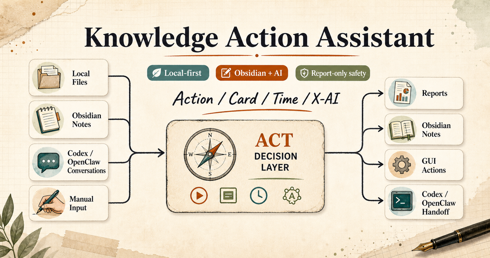

# Obsidian + AI Knowledge Action Assistant

> Local-first Obsidian and AI assistant for daily knowledge action, safe file radar, vault health checks, ACT notes, and Codex/OpenClaw handoff.



This project upgrades the original file-management assistant into a **Knowledge Action Assistant**. File scanning remains available, but the main workflow is now: turn local files, Obsidian notes, Codex/OpenClaw conversations, and manual input into actionable, reviewable, traceable personal knowledge work.


**Keywords:** Obsidian AI assistant, Obsidian knowledge management, personal knowledge management, local-first productivity, Windows file organizer, file radar, vault audit, Codex assistant, OpenClaw handoff, ACT notes, PKM automation.

## Who It Is For

- Obsidian users who want a practical workflow instead of a complex PKM theory system.
- Windows users who need safe review-first file organization, not risky auto-cleanup.
- Codex/OpenClaw users who want conversations and decisions archived into Obsidian.
- People who want daily guidance such as “今天先干什么” without processing every historical backlog item.

## Core Workflow

```text
输入层：本地文件 / Obsidian 笔记 / Codex 会话 / OpenClaw 记录 / 手动输入
判断层：生活 / 学习 / 工作 + Action / Card / Time / X-AI
执行层：文件雷达 / Obsidian 体检 / 收件箱归位 / 任务记录 / 知识卡沉淀 / 时间复盘 / Codex 交接
输出层：本地报告 / Obsidian 笔记 / GUI 操作入口 / Codex prompt / 可选通知
```

## Scenario Entrypoints

The GUI and playbook are scenario-first:

- `今天先干什么`: read the latest reports and return only 1-3 daily priorities.
- `记录一个任务`: create an Action note with goal, background, process, result, next step, and acceptance criteria.
- `这段内容放哪`: route content by 生活 / 学习 / 工作, then inbox/daily/project/routine/archive.
- `复盘今天`: create a lightweight Time review without turning daily work into backlog cleanup.
- `检查知识库`: audit inbox, stubs, low-link notes, broken links, duplicate titles, and Codex index gaps.
- `生成 Codex 交接`: generate a prompt with paths, boundaries, goals, and acceptance checks.
- `查看文件雷达`: view recent files, archive candidates, large files, and duplicate groups.
- `打开 Obsidian`: open the configured vault.

## Safety Policy

By default, the assistant is report-only and note-writing only.

It does not:

- Delete source files.
- Move source files.
- Rename source files.
- Rewrite source documents.
- Scan secret/session folders by default.
- Commit credentials.

Any future destructive action must require an allow-list, dry-run manifest, and rollback plan.

## Quick Start

```powershell
git clone https://github.com/zhangzeyu99-web/file-management-assistant.git
cd file-management-assistant
Copy-Item .\config.example.json .\config.local.json
notepad .\config.local.json
```

For a faster first run:

```powershell
powershell -NoProfile -ExecutionPolicy Bypass -File .\scripts\init-assistant.ps1
```

The initializer creates local reports and Obsidian notes only. It does not delete, move, rename, or rewrite source files.

Run tests:

```powershell
python -m unittest discover -s tests -v
```

Start the GUI:

```powershell
powershell -NoProfile -ExecutionPolicy Bypass -File .\start-assistant-gui.ps1
```

Open:

```text
http://127.0.0.1:8765/
```

## CLI Examples

Run the scenario demo:

```powershell
python .\scenario_playbook.py demo --config .\config.json
```

Open the guidebook catalog:

```powershell
python .\assistant_evolution.py guidebook
```

Generate the self-evolution report:

```powershell
python .\assistant_evolution.py report --config .\config.json
```

Query reusable knowledge:

```powershell
python .\assistant_evolution.py call --query "ACT 方法怎么复用"
```

Generate the Obsidian guide:

```powershell
python .\obsidian_assistant.py guide
```

Ask how to use the workflow:

```powershell
python .\obsidian_assistant.py ask "我今天怎么记录工作？"
```

Create ACT notes:

```powershell
python .\obsidian_assistant.py action --title "更新知识行动助手" --domain "工作" --goal "完成结构重整" --source "Codex 会话"
python .\obsidian_assistant.py card --title "ACT 方法" --domain "学习" --source "Obsidian 课程" --conclusion "先行动，再沉淀知识。"
python .\obsidian_assistant.py review --title "今日复盘" --period daily --done "完成结构设计" --next "跑测试验证"
```

Run the file radar without optional notification delivery:

```powershell
powershell -NoProfile -ExecutionPolicy Bypass -File .\run-file-assistant.ps1 -Mode Test -SkipFeishu
```

## Repository Layout

```text
.
|-- config.json
|-- config.example.json
|-- config_loader.py
|-- file_assistant.py
|-- obsidian_assistant.py
|-- obsidian_manager.py
|-- scenario_playbook.py
|-- gui_server.py
|-- run-file-assistant.ps1
|-- run-obsidian-manager.ps1
|-- run-obsidian-assistant.ps1
|-- start-assistant-gui.ps1
|-- docs/
|-- scripts/
|   |-- install-scheduled-task.ps1
|   `-- verify-harness.ps1
`-- tests/
```

## Configuration

`config.json` is the portable public default. `config.local.json` is ignored by Git and should contain private machine-specific paths.

Supported path values can use Windows environment variables such as `%USERPROFILE%` and `%LOCALAPPDATA%`.

Read more:

- [Configuration](docs/CONFIGURATION.md)
- [Getting Started](docs/GETTING_STARTED.md)
- [Obsidian Workflow Tutorial](docs/OBSIDIAN_WORKFLOW_TUTORIAL.md)
- [Guidebook PDF and slides](docs/guidebook/README.md)

## Validation

Run the release harness:

```powershell
powershell -NoProfile -ExecutionPolicy Bypass -File .\scripts\verify-harness.ps1
```

The harness checks unit tests, secret-like patterns, dry-run execution, Obsidian audit dry-run, project quality, and Git state.

## Documentation

- [Guidebook](docs/guidebook/README.md)
- [Architecture](docs/ARCHITECTURE.md)
- [Project Principles](docs/PROJECT_PRINCIPLES.md)
- [Self Evolution Roadmap](docs/SELF_EVOLUTION.md)
- [User Scenarios](docs/USER_SCENARIOS.md)
- [Closed Loop Usage](docs/CLOSED_LOOP_USAGE.md)
- [Maintenance](MAINTENANCE.md)
- [Security](SECURITY.md)

## License

MIT. See [LICENSE](LICENSE).
