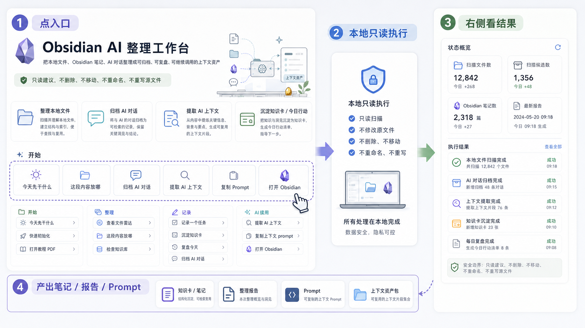
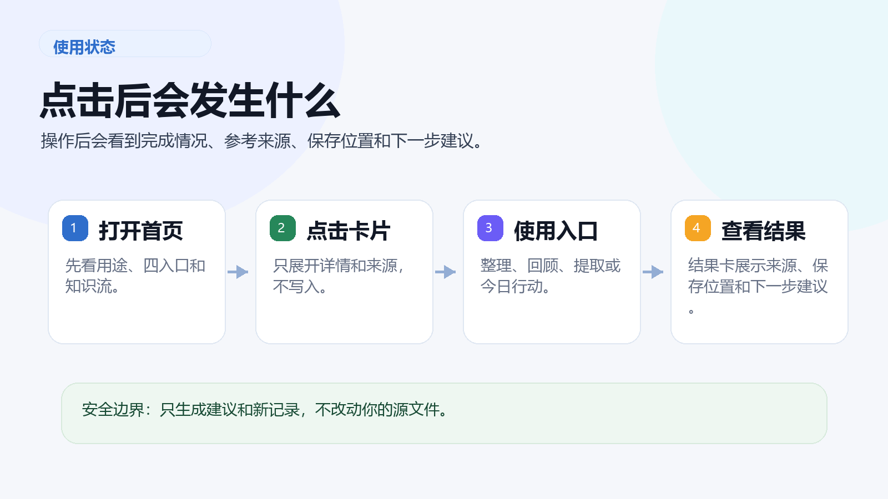

# GUI 交互说明

这份说明只回答一件事：GUI 怎么帮助 Codex 少读上下文。它不是替代 Codex 的控制台，而是一个可视化上下文入口，把本地文件、Obsidian、历史报告和 AI 对话归档整理成 Codex 接手包。





## 核心链路

```text
看本地上下文概览 -> 写要交给 Codex 的任务 -> 生成 Codex 接手包 -> 复制 prompt 给 Codex -> Codex 基于真实路径继续处理
```

文件类任务还有一条独立输入链路：在“本地文件 / 目录目标”里粘贴 Windows 路径，或拖放/选择文件用于上下文提示；点击“检查本地目标”做只读识别，再点“查看文件雷达”生成本次报告。没有粘贴路径时，文件雷达使用配置文件里的默认扫描目录。

默认安全边界不变：只读建议，不删除、不移动、不重命名、不重写源文件。只有明确的记录类按钮会写入新的 Obsidian 笔记。

## 页面状态

| 状态 | 用户看到什么 | 说明 |
| --- | --- | --- |
| 打开页面 | 可视化上下文入口、四类来源、本地上下文概览 | 先知道有哪些现成材料可给 Codex |
| 写任务 | Codex 接手包输入框 | 写“接下来要交给 Codex 做什么”，不是粘贴一堆源文件 |
| 放入本地目标 | 本地文件 / 目录目标 | 粘贴真实路径用于扫描；拖放/选择文件只作为上下文提示 |
| 生成接手包 | 接手包预览显示来源、摘要、边界和下一步 | 结果来自 `build-ai-context` |
| 复制 prompt | 复制可直接发给 Codex 的上下文 prompt | 新对话能少问路径、少重复读历史 |
| 排查详情 | 展开高级 JSON | 仅用于调试，不是默认体验 |

## 可点击入口

| 区域 | 按钮 | 输入要求 | 实际动作 | 页面结果 | 文件影响 |
| --- | --- | --- | --- | --- | --- |
| Codex 接手包 | 生成 Codex 接手包 | 建议写当前任务 | `build-ai-context` | 输出来源路径、相关原因、压缩上下文、下一步请求 | 不写文件 |
| Codex 接手包 | 问怎么用 | 可空 | `ask` | 输出针对当前问题的用法建议 | 不写文件 |
| Codex 接手包 | 判断放哪 | 建议粘贴一段内容 | `inbox-route` | 返回生活/学习/工作分流和放置建议 | 不写文件 |
| Codex 接手包 | 复制上下文 | 建议写当前任务 | `build-ai-context` 后复制 `prompt` | 复制可直接发给 Codex 的 Prompt | 不写文件 |
| 本地文件 / 目录目标 | 检查本地目标 | 粘贴本地路径；可拖放/选择文件 | `inspect-local-targets` | 返回路径是否存在、文件/目录类型、预览数量 | 不写文件 |
| Codex 接手流程 | 新手 10 分钟上手 | 可空 | `today` | 只给 1-3 个轻量重点 | 不写文件 |
| Codex 接手流程 | 查看交互说明图 | 可空 | `open-interaction-guide` | 打开本页图文说明 | 不改源文件 |
| 开始 | 今天先干什么 | 可空 | `today` | 只给 1-3 个今日重点 | 不写文件 |
| 开始 | 快速初始化 | 可空 | `onboarding` | 返回初始化步骤和命令 | 不写文件 |
| 开始 | 打开教程 PDF | 可空 | `open-guidebook` | 打开教程 PDF | 不改源文件 |
| 开始 | 查看交互说明 | 可空 | `open-interaction-guide` | 打开交互说明页 | 不改源文件 |
| 整理 | 查看文件雷达 | 可空；若已粘贴路径则优先扫描该目标 | `file-radar` | 返回本地文件报告、候选、大文件等 | 只生成或读取报告 |
| 整理 | 这段内容放哪 | 建议粘贴内容 | `inbox-route` | 返回分流建议 | 不写文件 |
| 整理 | 检查知识库 | 可空 | `obsidian-health` | 返回收件箱、断链、空壳笔记等体检结果 | 只生成或读取报告 |
| 记录 | 记录一个任务 | 建议写任务目标 | `action-note` | 新建 Action 任务笔记 | 写新笔记 |
| 记录 | 沉淀知识卡 | 建议写可复用结论 | `card-note` | 新建 Card 知识卡 | 写新笔记 |
| 记录 | 复盘今天 | 建议写完成事项 | `time-review` | 新建 Time 复盘笔记 | 写新笔记 |
| 记录 | 归档 AI 对话 | 建议粘贴对话摘要 | `archive-ai-chat` | 新建 AI 对话归档笔记 | 写新笔记 |
| AI 续用 | 提取 AI 上下文 | 建议写当前任务 | `build-ai-context` | 生成 Codex 接手包 | 不写文件 |
| AI 续用 | 复制上下文 prompt | 建议写当前任务 | `build-ai-context` 后复制 | 复制可直接发给 Codex 的 Prompt | 不写文件 |
| AI 续用 | 打开 Obsidian | 可空 | `open-obsidian` | 打开本地 vault 路径 | 不改源文件 |
| 右侧 | 刷新状态 | 可空 | `/api/status` | 刷新文件数、候选数、笔记数、报告时间 | 不写文件 |
| 右侧 | 查看高级 JSON | 可空 | 前端展开输出框 | 显示最近一次 action 的完整 JSON | 不写文件 |

## 怎么判断该点哪个

| 你的目的 | 直接点 |
| --- | --- |
| 想让 Codex 接手一个任务但不想重新解释背景 | 生成 Codex 接手包 |
| 想让新 AI 对话先理解你已有上下文 | 提取 AI 上下文或复制上下文 prompt |
| 想保存一段已经发生的 AI 对话 | 归档 AI 对话 |
| 不知道一段内容该放生活、学习还是工作 | 这段内容放哪 |
| 想先确认粘贴的路径能否识别 | 检查本地目标 |
| 想检查本地文件有哪些可用材料 | 粘贴路径后点查看文件雷达；不粘贴则使用默认扫描目录 |
| 想检查 Obsidian 有没有乱 | 检查知识库 |
| 想把一个真实任务记下来 | 记录一个任务 |
| 想把一条经验留给以后复用 | 沉淀知识卡 |
| 想把今天轻量收尾 | 复盘今天 |

## 失败时看哪里

如果接手包预览显示失败，先点“查看高级 JSON”。里面会有 `error`、`path`、`sources` 或 `prompt` 等字段。需要继续让 Codex 排查时，把这段 JSON 复制给 Codex，比只描述“按钮没反应”更有效。
